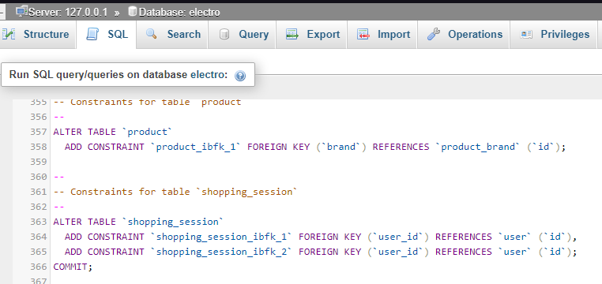
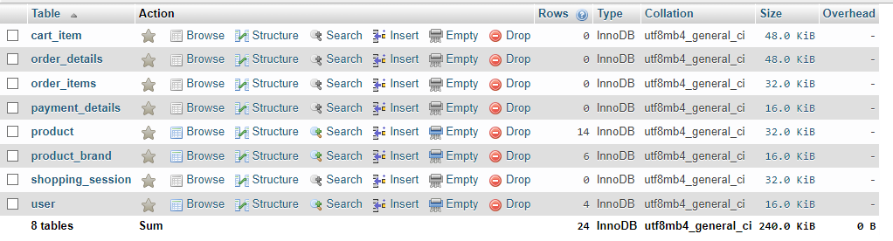

# Website Design - Web Programming
An ecommerce website for laptop only

#### Project Structure
1. Server Platform: XAMPP
2. Language: HTML, CSS
3. Database: MySQL

#### Usage steps:
1. Clone the repository to your PC, make sure the path is C:\xampp\htdocs\Electro\&lt;all files&gt;
2. Start the Apache and MySQL with XAMPP Control Panel
3. Navigate to phpmyadmin, create a database named **electro**

4. Open **electro.sql** file, copy all contents, and add to the **electro** database

5. Make sure the structure will look as below figure after entering the SQL.

6. Open a web browser, type localhost/Electro/index.php,
it will open the index.php which is the home page of website.

> Note: The details for implementation are all inside the html files. There are some function that have not been implemented yet and they will be updated in the future.

#### Feature Checklist
- [x] Laptop categorized by brands
- [ ] Laptop categorized by components
- [ ] Store shopping session and Add to cart
- [ ] Payment and checkout
- [x] Database structure/SQL/Procedures
- [x] Login/Logout/Registers function for users
- [ ] Login/Logout function for staffs (WIP)
- [x] Show address of different stores with Google Maps (80%, only for 1 store now)
- [x] Show location of user right in the website
- [ ] \(Optional) Show direction from user's location to store's location (WIP)
- [x] Apply responsive design to website (product grid, navbar, google map)
- [x] Use appropriate colors to website (minimal design and color palette)
- [x] Navigation bar, logo, footer (footer will be improved later)

